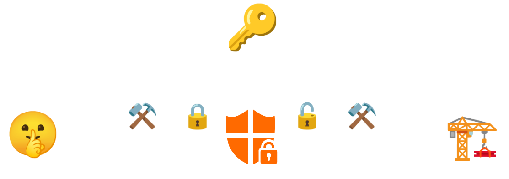

# Dein Geheimnis ist bei mir sicher

Chemnitzer Linux Tage, 22.03.2025

Alexander Böhm

---

## Zu mir

* Infrastruktur
* <!-- .element: class="fragment" -->Applikationsentwicklung
* <!-- .element: class="fragment" -->Architektur
* <!-- .element: class="fragment" -->Aktuell: hauptsächl. DevOps

---

## Das Umfeld

* Infrastructure as Code
<div>

<!-- .element: class="fragment" -->
<!-- .element: class="fragment" --><span class="fragment">


</span>
</div>
* <!-- .element: class="fragment" -->Arbeit im Team
* <!-- .element: class="fragment" -->Continous Integration/Delivery
* <!-- .element: class="fragment" -->Automation

---

## Problem

<div class="r-stack">


</div>

---


---

## Secret Scanner

<ul>
<li>Credential in Git-History <span class="fragment">🔥</span></li>
<li class="fragment">Heuristiken</li>
<li class="fragment">Erkennung von Secrets <span class="fragment">🚨</span></li>
<li class="fragment">Git Commit-Hook <span class="fragment">😅</span></li>
</ul>

---

## Detect Secrets


---

### Verwendung

```sh [1-2|4-5|7-8]
# Initialer Scan
detect-secrets scan > .secrets.baseline

# Scan bei Veränderungen
detect-secrets scan --baseline .secrets.baseline

# Auditierung der Veränderungen
detect-secrets audit .secrets.baseline
```

---

✅ Keine Passwörter im Klartext

---


---

## Konzepte

---

### Verschlüsselte Speicherung


---

### Server-gestützt



---

## Lösungen

* Ansible Vault
* Mozilla SOPS
* Bitnami Sealed Secrets
* HashiCorp Vault

---

### Ansible Vault

* sym. Verschlüsselung
* <!-- .element: class="fragment" -->Speicherung als Datei/verschl. String
* <!-- .element: class="fragment" -->versch. Vaults mögl.
* <!-- .element: class="fragment" -->Integration
  * Ansible: Direkte Integration
  * OpenTofu/Terraform: Community Provider
  * Kubernetes: Deployment als Secrets

---

#### Benutzung Ansible

```sh [1-2|4-5|7-8|10-11]
# Verschl. Datei erstellen
ansible-vault create host_vars/my-machine.yml

# Editieren 
ansible-vault edit host_vars/my-machine.yml

# Verschlüsselung Strings
pwgen -s 32 1 | ansible-vault encrypt_string

# Verwendung als Variable
ansible -m debug -a 'var=my_secret' localhost
```

---

**Demo**

---

### Mozilla SOPS

* ähnl. Ansible Vault
* <!-- .element: class="fragment" -->Verschlüssel. via GPG/Age
* <!-- .element: class="fragment" -->Integration
  * Ansible: Community
  * Terraform: Community Provider
  * Kubernetes: FluxCD, ArgoCD Plugins
* <!-- .element: class="fragment" -->Support für AWS/GCP/Azure

---

#### Konfiguration `.sops.yaml`

```yaml [2-5,12-14|6-7|9-10]
creation_rules:
  # Age Konfiguration
  - age: >-
      age1m8kn[...]

    # Pattern für Dateien
    path_regex: .*-secret.yml

    # Selector für Einträge
    encrypted_regex: '^(data|stringData)$'

  # PGP Konfiguration
  - pgp: >-
      C2AA[...]
```

---

#### Benutzung

```sh [1-5|7-8|10-11|13-14]
# Manifest für Kubernetes erstellen
kubectl create secret generic my_secret \
    --from-literal=sops=$(pwgen -s 32 1) \
    -o yaml \
    --dry-run=client >secret.yml

# Datein verschlüsseln und ersetzen
sops encrypt --in-place secret.yml

# Entschlüsseln
sops decrypt secret.yml

# Editieren
sops edit secret.yml
```

---

#### Terraform

```hcl [3-6|10-12|16-17,19-21]
terraform {
  required_providers {
    sops = {
      source  = "carlpett/sops"
      version = "1.1.1"
    }
  }
}

data "sops_file" "sops-secret" {
  source_file = "sops.json"
}

resource "kubernetes_secret" "sops-secret" {
  metadata {
    name = "sops-secret"
    namespace = "clt2025" 
  }
  data = {
    secret = data.sops_file.sops-secret.data.data
  }
  type = "Secret"
}
```

---

### Ansible

```jinja2
- name: Show encrypted SOPS
  ansible.builtin.debug:
    msg: >-
      The secret is: {{ 
        lookup('community.sops.sops', 'sops-secret.txt')
      }}
```

---

**Demo**

---

### Sealed Secrets

* Server-gestützt
* <!-- .element: class="fragment" -->hauptsächl. Kubernetes
* <!-- .element: class="fragment" -->Operator generiert Secrets
* <!-- .element: class="fragment" -->Integration 
  * außerhalb Kubernetes 😭
  * FluxCD, ArgoCD mögl.

---

#### Benutzung

```sh [1-6|8-9|11-12]
# Secret Manifest erstellen
kubectl create secret generic sealed-secret \
    --dry-run=client \
    --from-literal=my_secret="A sealed secret" \
    -o yaml \
    >sealed-secret.yml

# Manifest verschlüsseln
kubeseal -f sealed-secret.yml -w sealed-secret.yml

# Manifest anwenden
kubectl apply -f sealed-secret.yml
```

---

#### Verschl. Manifest

```yaml[1-2,5-6|8-9,13-14]
apiVersion: bitnami.com/v1alpha1
kind: SealedSecret
metadata:
  creationTimestamp: null
  name: sealed-secret
  namespace: clt2025
spec:
  encryptedData:
    secret: AgBJLvkT[...]FEecjpvG
  template:
    metadata:
      creationTimestamp: null
      name: sealed-secret
      namespace: clt2025
```

---

**Demo**

---

### HashiCorp Vault

* Server-gestützt
* <!-- .element: class="fragment" -->Vault Freischaltung notw. 
* <!-- .element: class="fragment" --> Umfangr. Zugriffsverwaltung
* <!-- .element: class="fragment" -->Integration
  * ✅ Kubernetes-Operator 
  * ✅ Community-Support Ansible
  * ✅ Terraform Provider

---

```sh [1-2|4-5|7-8|10-11]
# Vault aufschließen
vault operator unseal

# Vault schließen
vault operator seal

# Eintrag erstellen
vault kv put clt2025/kubernetes my_secret="A vault secret"

# Eintrag auslesen
vault kv get -mount=clt2025 kubernetes
```

---

#### Bsp. Ansible

```jinja2 [5-11]
- name: Read a secret from vault
  ansible.builtin.debug:
    msg: >-
      {{ 
        lookup("community.hashi_vault.vault_kv2_get", 
               # Item
               "ansible/static",
               engine_mount_point="clt2025",
               url="https://vault.demo.local")
               # Lese Klartextdaten
               .raw.data.data
      }}
```

---

#### Bsp. Terraform

```terraform [4-7|12,14-15|19,21-27]
terraform {
  required_providers {
    // Vault Provider definieren
    vault = {
      source  = "hashicorp/vault"
      version = "4.6.0"
    }
  }
}


// Secrets Engine definieren
resource "vault_mount" "clt2025" {
  path        = "clt2025"
  type        = "kv"
  options     = { version = "2" }
}

// Eintrag in Engine definieren
resource "vault_kv_secret_v2" "kvv2-secret" {
  mount = vault_mount.clt2025.path
  name  = "terraform"
  data_json = jsonencode(
    {
      "my_secret" = "A secret string"
    }
  )
}
```

---

#### Bsp. Kubernetes

```yaml [1-2,4-5|7-8|10-15|17-20|22-28]
apiVersion: secrets.hashicorp.com/v1beta1
kind: VaultStaticSecret
metadata:
  name: simple-app-with-vault
  namespace: clt2025
spec:
  # Authentifikation 
  vaultAuthRef: static-auth

  # Secret Engine
  type: kv-v2
  # Mount
  mount: clt2025
  # Pfad zum Eintrag
  path: kubernetes

  # Ziel Kubernetes Secret
  destination:
    name: vault-secret
    create: true

  # Aktualisierungsintervall
  refreshAfter: 3s

  # Neustart von Deployments bei Änderungen 
  rolloutRestartTargets:
    - kind: Deployment
      name: simple-app-with-vault
```

---

**Demo Operator**

---

## Bewertung

<div style="font-size: xx-large">
<table>
<thead>
<tr>
<th>Lösung</th>
<th>Funktionalität</th>
<th>Interoperabilität</th>
<th>Einfachheit</th>
</tr>
</thead>
<tbody>

<tr>
<td>Ansible Vault</td>
<td>🔴<br>
</td>
<td>🟡🟡<br>
</td>
<td>🟢🟢🟢<br>
</td>
</tr>

<tr>
<td>Sealed Secrets</td>
<td>🟡🟡<br>
</td>
<td>🔴<br>
</td>
<td>🟡🟡<br>
</td>
</tr>

<tr>
<td>SOPS</td>
<td>🟡🟡<br>
</td>
<td>🟡🟡<br>
</td>
<td>🟢🟢🟢</td>
</tr>

<tr>
<td>HashiCorp Vault</td>
<td>🟢🟢🟢<br>
</td>
<td>🟢🟢🟢<br>
</td>
<td>🔴<br>
</td>
</tr>
</tbody>
</table>
</div>

---

# Fazit

* <!-- .element: class="fragment" -->Verschied. Lösungen
* <!-- .element: class="fragment" -->Verschied. Konzept & Workflows
* <!-- .element: class="fragment" -->Unterschiedl. Komplexität
* <!-- .element: class="fragment" -->⚠️ Stolpferfallen
<br>
<br>
<div class="fragment" style="font-size: xx-large">
<strong>Nachfragen / Folien / Demo</strong><br>
<span><a href="https://github.com/aboehm/clt2025-secret-management">github.com/aboehm/clt2025-secret-management</a></span><br>
<span>alexander.boehm@malbolge.net</span>
</div>
