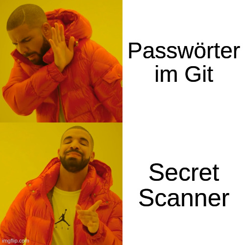

# Dein Geheimnis ist bei mir sicher

Chemnitzer Linux Tage, 22.03.2025

Alexander Böhm

---

## Zu mir

<ul>
<li class="fragment">Infrastruktur</li>
<li class="fragment">Applikationsentwicklung</li>
<li class="fragment">Architektur</li>
<li class="fragment">Aktuell: hauptsächlich DevOps</li>
<li class="fragment">DevOps ist Kultur und keine Person</li>
</ul>

---

## Das Umfeld

<ul>
<li class="fragment">Infrastruktur
<div>


<span class="fragment">


</span>
</div>
</li>
<li class="fragment">Dokumention</li>
<li class="fragment">Infrastructure as Code</li>
<li class="fragment">Arbeit im Team</li>
<li class="fragment">Continous Integration/Delivery</li>
</ul>

---

## Das Problem

<ul>
<li class="fragment">Anwendungen brauchen Credentials
<br><span class="fragment">✅ Environment, Zertifikate, etc.</span>
<br><span class="fragment">✅ Secure Coding</span>
</li>
<li class="fragment">Cloud braucht Zugänge<br>
<span class="fragment">✅ Eigenes Credential Management</span>
<br><span class="fragment">✅ OIDC / SSO</span>
</li>
<li class="fragment">Deployments brauchen Credentials
<br><span class="fragment">🤔 Wo die Credentials speichern?</span>
</li>
</ul>

---

<div class="r-stack">
    
    
    
    
</div>

---



---

## Secret Scanner

<ul>
<li>Credential in Git-History <span class="fragment">🔥</span></li>
<li class="fragment">Heuristik Schlagwörtern/Entropy</li>
<li class="fragment">Erkennung von Secrets <span class="fragment">🚨</span></li>
<li class="fragment">Git Commit-Hook <span class="fragment">😅</span></li>
</ul>

---

## Detect Secrets


---

### Verwendung

```sh
# Initialer Scan
detect-secrets scan > .secrets.baseline

# Scan bei Veränderungen
detect-secrets scan --baseline .secrets.baseline
# Auditierung der Veränderungen
detect-secrets audit .secrets.baseline
```

---

✅ Keine Passwörter mehr im Klartext
🤔 Wo speichern? 

---

## Konzepte

---

### Verschlüsselte Speicherung


---

### Server-gestützt


---

## Lösungen

---

### Ansible Vault

* Verschlüsselte Speicherung
* Gemeinsames Secret
* ⚠️  Integration
  * ✅ Ansible: Direkte Integration
  * ✅ Terraform Provider
  * ⚠️  Kubernetes Secrets

---

### Mozilla SOPS

* Verschlüsselte Speicherung
* Asym. Verschlüsselung via GPG/Age
* Integration
  * ✅ Community-Support Ansible
  * ✅ Terraform Provider
  * ✅ Kubernetes FluxCD
  * ⚠️  Kubernetes ArgoCD (KSOPS)
  * ✅ AWS/GCP 

---

```sh
# Manifest für Kubernetes erstellen
kubectl create secret generic mysecret \
    --from-literal=sops=$(pwgen -s 16 1) -o yaml --dry-run=client >secret.yml
# Secret verschlüsseln und ersetzen
sops encrypt --in-place secret.yml
# Secret entschlüsseln
sops decrypt secret.yml
# Secret editieren
sops edit secret.yml
```

---

### Sealed Secrets

* Server-gestützt
* Operator gen. Key für Verschlüsselung Secrets
* Client injected Secrets -> Operator deployed Secrets
* Integration 
  * ❌ außerhalb Kubernetes
  * ⚠️  CLI Tricks

---

### HashiCorp Vault

* Server-gestützt
* Vault muss mit Schlüssel freigeschaltet werden
* Clients greifen auf Vault zu
* Integration über mehrere Tools
  * ✅ Kubernetes-Operator 
  * ✅ Community-Support Ansible
  * ✅ Terraform Provider
